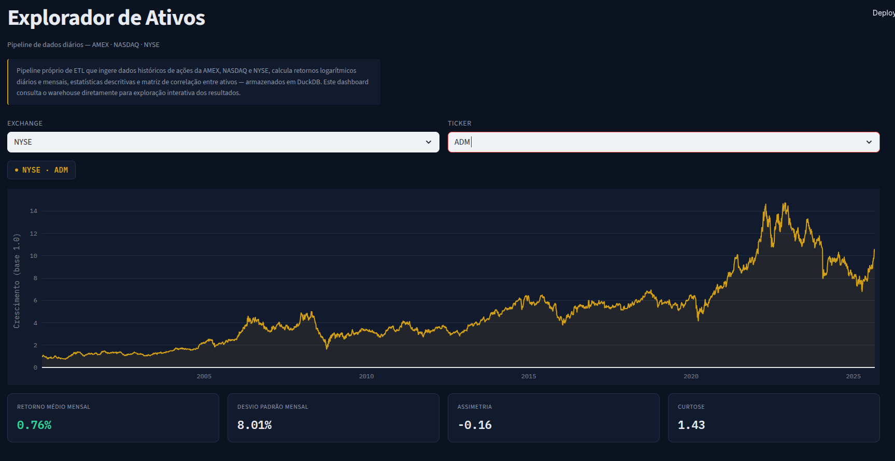

# Financial Data Pipeline & Quant Dashboard

Pipeline de dados e dashboard analítico para o mercado acionário norte-americano (AMEX, NASDAQ e NYSE), transformando cotações brutas em métricas quantitativas com uma interface interativa no estilo terminal financeiro.

---

## Sobre o projeto

Pipeline próprio de ETL que ingere dados históricos de ações da AMEX, NASDAQ e NYSE, calcula retornos logarítmicos diários e mensais, estatísticas descritivas e matriz de correlação entre ativos — armazenados em DuckDB. O dashboard consulta o warehouse diretamente para exploração interativa dos resultados.

## Funcionalidades

- **ETL automatizado** — tratamento de dados brutos de cotações, cálculo de retornos logarítmicos e organização por exchange
- **Data warehouse OLAP** — armazenamento e consultas de alta performance com DuckDB
- **Estatística quantitativa** — retorno médio, desvio padrão, assimetria e curtose por ativo
- **Matriz de correlação** entre ativos
- **Dashboard interativo** com filtros por exchange e ticker

## Stack

| Camada | Tecnologia |
|---|---|
| Linguagem | Python |
| ETL & Estatística | Pandas, NumPy |
| Banco de dados | DuckDB |
| Dashboard | Streamlit, Plotly |
